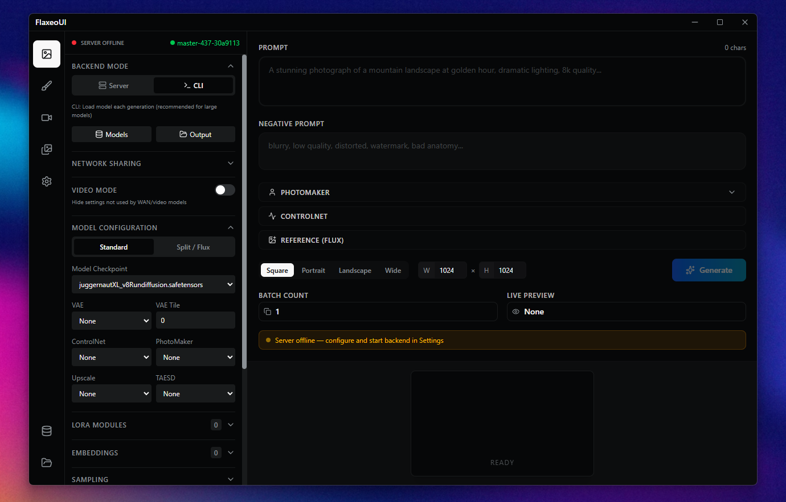

#  FlaxeoUI


A wrapper for **[stable-diffusion.cpp](https://github.com/leejet/stable-diffusion.cpp)**. Built with Electron and Node.js, I made it to be simple to interact with the stable difussion cpp cli

I created this wrapper to quickly test models on my PC. Currently, it has only been tested using Vulkan on Linux and Windows.





##  Getting Started

### Prerequisites
- **Node.js**: v16 or higher (Tested with v22.20.0).
- **stable-diffusion.cpp**: Tested with version `master-418-200cb6f`.
- **NPM**: Included with Node.js.

### Installation

1.  **Clone the repository**
    ```bash
    git clone https://github.com/yourusername/flaxeo-ui.git
    cd flaxeo-ui
    ```

2.  **Install dependencies**
    ```bash
    npm install
    ```

3.  **Run the application**
    ```bash
    npm start
    ```

## Development

To run the application in debug mode with hot-reloading for the frontend:

```bash

npm run dev
```


## Architecture

- **Frontend**: Vue 3, TypeScript, Tailwind CSS
- **Backend**: Node.js (Express) handling API requests and managing the `sd-server and sd-cli` subprocess.
- **Core**: Electron for the desktop application wrapper.
- **Inference**: Relies on `sd-server and sd-cli` (based on stable-diffusion.cpp) for efficient local inference.

## Credits

This project is a GUI to **[stable-diffusion.cpp](https://github.com/leejet/stable-diffusion.cpp)** by **[@leejet](https://github.com/leejet)**.

## License

[MIT License](LICENSE)
