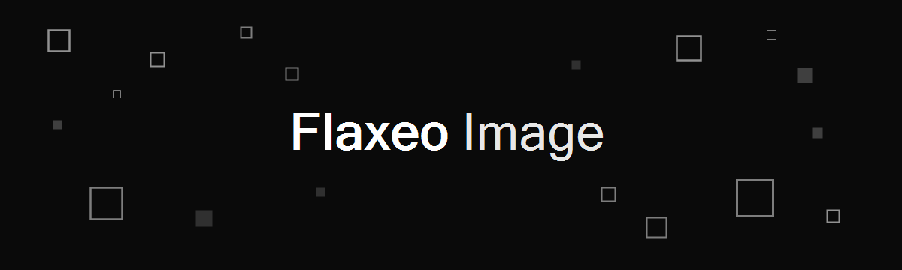
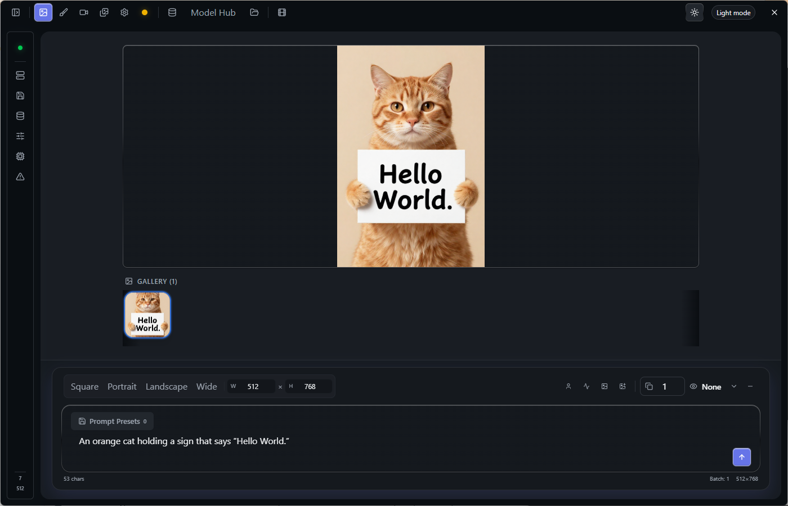

# Flaxeo Image


**Local. Fast. Beautiful.** A desktop studio for **[stable-diffusion.cpp](https://github.com/leejet/stable-diffusion.cpp)** 



## Features

- **Text2Image**, **Edit** (inpaint / multi-ref Kontext & Qwen Edit / img2img), **Video** (T2V, I2V, FLF2V)
- **Job queue** — generate while busy; reorder, pause, cancel
- **Recipes** — full-settings templates (surfaces, frames, objects, moods); import/export `.flaxeo-recipe.json`
- **Help** — offline guide including surfaces, frames, and batch/queue workflows
- **Gallery** with PNG parameter reuse, upscale, and generation history
- **Model Hub** starter packs (SDXL, FLUX, Z-Image, Wan, LTX, Qwen, …)
- Dual backend: **sd-cli** (default) or **sd-server**
- Hardware helpers: flash attention, VAE tiling, Low VRAM profile, cache presets
- Quantize / convert models to GGUF from the UI

## Disclaimer

- Installers may be flagged as untrusted until they are code-signed.
- **Local network share** is the supported way to reach the UI from other devices on the same LAN.
- **Ngrok / Cloudflare** tunnels are experimental (token/binary required; may fail on some networks).
- Developed primarily on Windows; Linux builds (AppImage / deb) are produced in CI.

## Prerequisites

- **Node.js** 20+ (tested with v22 / v23)
- A **stable-diffusion.cpp** build (`sd-cli` + `sd-server`) — download from the app Settings, or place binaries under `backend/custom/`

Tested against recent `master-*` release tags of stable-diffusion.cpp (see Settings → Backend).

## Getting started

1. Run the app (`npm run dev` or a release install).
2. Complete the **setup wizard**: install a backend → download a starter pack (GPU-recommended).
3. On finish, use **Generate sample** or follow the in-app checklist: Backend · Models · First image.
4. Optional: enable **Low VRAM** in setup if you are on a smaller GPU.

Skipped the wizard? A quiet **Getting started** strip stays until the first successful image (dismissible).

## Install & run

```bash
git clone https://github.com/fabricio3g/FlaxeoUI.git
cd FlaxeoUI
npm install
npm run dev
```

### Production preview

```bash
npm start
```

### API server only (no Electron)

```bash
node ./server.js
```

### Build

```bash
npm run build:win    # Windows
npm run build:linux  # Linux AppImage / deb
```

## Development

| Command                    | Purpose                                                   |
| -------------------------- | --------------------------------------------------------- |
| `npm run dev`              | Hot-reload Electron + Vue                                 |
| `npm run typecheck`        | TypeScript (main + renderer)                              |
| `npm test`                 | Unit tests (CLI args, errors, LoRA tokens, cache presets) |
| `npm run lint` / `lint:ci` | ESLint (CI fails on errors)                               |

Release smoke checklist: [docs/SMOKE.md](docs/SMOKE.md).

## Architecture

- **Frontend:** Vue 3, TypeScript, Tailwind CSS, Pinia
- **App shell:** Electron (electron-vite)
- **API:** Express managing `sd-cli` / `sd-server` subprocesses
- **Inference:** [stable-diffusion.cpp](https://github.com/leejet/stable-diffusion.cpp)

```
UI workspaces → Express routes → sd.ts arg builders → sd-cli / sd-server
```

## Credits

UI for **[stable-diffusion.cpp](https://github.com/leejet/stable-diffusion.cpp)** by **[@leejet](https://github.com/leejet)**.


## License

[MIT License](LICENSE)
